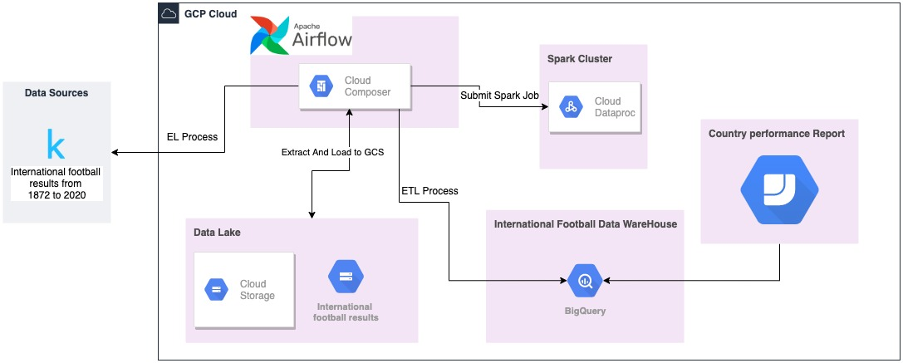

# International Football Results Analysis

## Summary 
This project is intended to provide an analytical report related to how each country perform in different scenarios, I will do this using gcp tools.
The data source I am going to use is from kaggle here the link: [dataset international football results from 1872 to 2020](https://www.kaggle.com/martj42/international-football-results-from-1872-to-2017) .

## Architecture

  
## Requisite  
* Access to GCP.

## Setup
#### Google Cloud Storage
You should create the following bucket and folders structure in gcp: 
Bucket name = int_football_bucket

* int_football_bucket/data_lake/football
* int_football_bucket/staging/football
* int_football_bucket/spark_jobs

### Cloud Composer
It is necessary to define the following variables in the instance of cloud composer UI: 
* gc_project_id
* gc_region
* gcs_football_bucket 

## Things to improve
* Better use of variable to replace literal values
* Create the bucket automatically and folder structure automatically
* Validate if the dataproc cluster exits and do not try to re-create it when it exits
* Convert the Spark Jobs into classes

