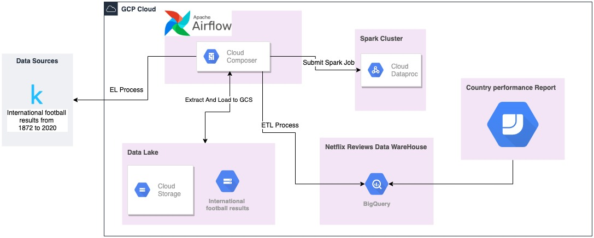

# International Football Results Analysis

## Summary 
This project is intended to provide an analytical report related to how each country perform in different scenarios, I will do this using gcp tools.
The data source I am going to use is from kaggle here the link: [dataset international football results from 1872 to 2020](https://www.kaggle.com/martj42/international-football-results-from-1872-to-2017) .

## Architecture

  
## Requisite  
* Access to GCP.